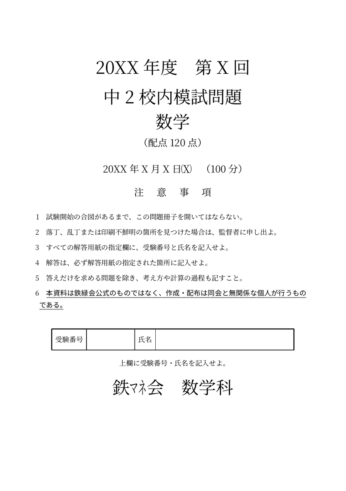
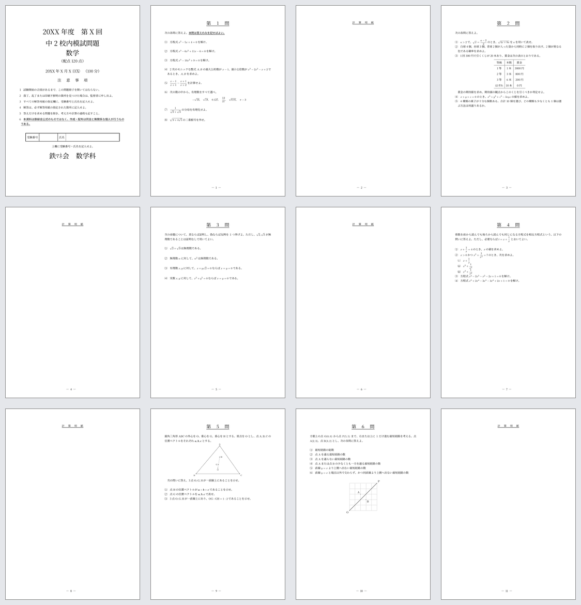
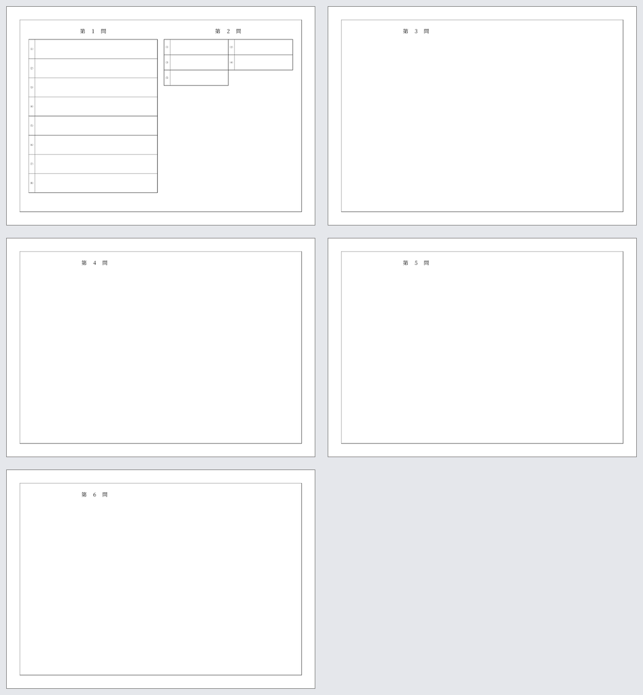

# 鉄緑の校内模試模試を作ろう（非公式）

## はじめに

**この記事は非公式です。鉄緑会とは関係のない個人による組版例です。**

手書き原稿と印刷原稿をもとに、中2数学の校内模試らしい問題冊子と解答用紙を LuaLaTeX で組みました。

今回作ったのは、雰囲気だけを寄せた1ページのサンプルではありません。

- B5判、全12ページの問題冊子
- 100分、120点、全6大問
- 表紙、注意事項、受験番号・氏名欄
- 大問ごとの下線付き見出し
- 大問間の計算用紙
- TikZによる幾何・経路図
- B4横判、全5ページの解答用紙
- `KKran`による短答欄・記述欄

までを一式で作っています。

実際の問題文、日付、受験者情報は公開せず、問題は計算・確率・命題・相反方程式・オイラー線・格子経路のサンプルへ差し替えました。ローカル制作時のヒラギノ指定も、TeX Live 収録の原ノ味フォントへ置き換えています。

テンプレート一式は [KKTeX/Publicated-Files の公開ディレクトリ](https://github.com/KKTeX/Publicated-Files/tree/main/Qiita/鉄緑の校内模試模試を作ろう（非公式）) に置いてあります。`git clone` 後、そのまま `make` で問題冊子と解答用紙を生成できます。



## 完成形

問題冊子は、表紙1ページ、問題6ページ、計算用紙5ページの合計12ページです。第5問と第6問は連続させ、最後にもう1ページ計算用紙を置いています。



解答用紙はB4横判です。1ページ目に第1問・第2問の`KKran`解答欄を置き、第3問〜第6問は各1ページを使う、合計5ページの構成です。



## 必要なもの

**TeX Live 2026以降**と、LuaLaTeXを使える環境を想定しています。

主なパッケージは次のとおりです。

| 役割 | パッケージ |
|---|---|
| 日本語組版 | `jlreq`, `luatexja-fontspec`, `luatexja-preset` |
| 数式 | `amsmath`, `amssymb`, `mathtools` |
| 問題番号 | `enumitem`, `KKsymbols` |
| 下線 | `luwa-ul` |
| 解答欄 | `KKran` |
| 図形 | TikZ |
| ページ番号 | `fancyhdr` |
| 解答用紙の外枠 | `eso-pic`, TikZ |

`KKran`と`KKsymbols`はLuaLaTeX専用です。最小構成のTeX Liveで見つからない場合は、次を実行します。

```sh
tlmgr install kkran kksymbols
```

## ファイル構成

公開用テンプレートは次の構成です。

```text
.
├── .latexmkrc
├── Makefile
├── fontset-public.sty
├── mock-exam.tex
└── mock-answersheet.tex
```

ビルドは次の1行です。

```sh
make
```

`mock-exam.pdf`と`mock-answersheet.pdf`が生成されます。

## 問題冊子の骨格は元の構成をそのまま残す

問題冊子のクラス、判型、パッケージ構成、余白は次のようにしています。

```latex
\documentclass[paper=b5,fontsize=10pt]{jlreq}
\usepackage{
  amsmath,amssymb,mathtools,
  fontset-public,KKsymbols,luwa-ul,
  enumitem,fancyhdr,
  wrapfig2,luatexja-otf,modernruler,
  tikz
}
\usepackage[unit=1\zw,tensenoff=0pt]{KKran}
\usepackage[left=20mm,right=20mm,top=30mm,bottom=0mm]{geometry}
```

表紙が終わった後だけ、問題ページ向けの余白へ切り替えます。

```latex
\newgeometry{left=18mm,right=18mm,top=20mm,bottom=20mm}
```

これにより、表紙は中央に情報を集め、問題ページは本文幅を少し広く取れます。

## ヒラギノ依存をHarano Ajiへ置き換える

ローカル版ではヒラギノのファミリ名とウェイトを直接指定していました。そのまま公開すると、同じフォントを持たない環境ではコンパイルできません。

ただし、本文中の`\HiraginoKakuGothic{3}`まで全部書き換えると、公開版とローカル版の差分が大きくなります。そこで、公開用の`fontset-public.sty`に互換コマンドを作りました。

```latex
\RequirePackage[no-math]{fontspec}
\RequirePackage[no-math,match,scale=1]{luatexja-fontspec}
\RequirePackage[haranoaji,deluxe]{luatexja-preset}

\setmainfont{HaranoAjiMincho-Regular}
  [BoldFont=HaranoAjiMincho-Bold]
\setmainjfont{HaranoAjiMincho-Regular}
  [BoldFont=HaranoAjiMincho-Bold]
```

原ノ味角ゴシックの4ウェイトを読み込み、元の0〜8の指定を近いウェイトへ写像します。

```latex
\NewDocumentCommand{\HiraginoKakuGothic}{m}{%
  \ifcase#1\HaranoGothicRegular
  \or\HaranoGothicRegular
  \or\HaranoGothicRegular
  \or\HaranoGothicRegular
  \or\HaranoGothicRegular
  \or\HaranoGothicMedium
  \or\HaranoGothicBold
  \or\HaranoGothicHeavy
  \or\HaranoGothicHeavy
  \else\HaranoGothicRegular
  \fi
}
```

名前は互換用に残っていますが、実際に読み込まれるのはHarano Ajiです。この方法なら、問題冊子側の変更をほぼ`fontset-public`への差し替えだけに抑えられます。

## 表紙の受験番号・氏名欄も`KKran`

表紙の入力欄は普通の`tabular`に置き換えず、元の構成どおり`KKran`で作ります。

```latex
\KKran{%
  \小問欄{5}{3}[center={受験番号}]
  \小問欄{7}{3}
  \小問欄{3}{3}[center={氏名}]
  \小問欄{20}{3}%
}
```

`unit=1\zw`なので、横幅は1全角単位です。ラベル付きの欄と記入欄を同じ枠組みで連結できます。

表紙には非公式であることも明記します。

```latex
\namiKK{%
  \HiraginoKakuGothic{3}%
  本資料は鉄緑会公式のものではなく、
  作成・配布は同会と無関係な個人が行うものである。%
}
```

## 大問見出しと計算用紙をコマンドにする

大問見出しは、5全角幅へ均等配置した文字列に下線を引きます。

```latex
\NewDocumentCommand{\ExamTitle}{m}{%
  \begin{center}
    \LARGE
    \underLineKK[height=.8pt]{\makebox[5\zw][s]{第#1問}}
  \end{center}
  \vspace{\baselineskip}
}
```

本文では次のように呼びます。

```latex
\ExamTitle{4}
係数を前から読んでも後ろから読んでも同じになる
方程式を相反方程式という。
```

計算用紙も同じ見た目にします。

```latex
\NewDocumentCommand{\ScratchPage}{}{%
  \newpage
  \begin{center}
    \underLineKK[height=.8pt]{\makebox[8\zw][s]{計算用紙}}
  \end{center}
}
```

各大問の後で`\ScratchPage`を呼ぶことで、元のページ構成をそのまま再現できます。

## 小問番号と入れ子を揃える

小問は`enumitem`で専用リストを作ります。

```latex
\newlist{mondai}{enumerate}{2}
\setlist[mondai,1]{
  label=\kakko{\arabic*},
  leftmargin=1\zw,
  listparindent=1\zw,
  labelsep=1\zw,
  itemindent=1\zw,
  topsep=0mm
}
```

第4問のような入れ子では、ローマ数字を括弧に入れます。

```latex
\setlist[mondai,2]{
  label=\kakko{%
    \mruleth[height=.7\zw,width=0pt]\Rrnum{\arabic*}%
  },
  leftmargin=1\zw,
  listparindent=1\zw,
  labelsep=1\zw,
  itemindent=1\zw,
  topsep=0mm
}
```

短答8問用には、項目間隔を揃えた`densemondai`を別に作っています。

## TikZ図も別画像へ逃がさない

第5問ではオイラー線、第6問では格子経路を扱うサンプルへ差し替えました。図はTikZで本文と一緒に管理します。

```latex
\begin{tikzpicture}[scale=.72]
  \draw[step=1,gray!65,very thin] (0,0) grid (5,5);
  \draw[thick] (0,0)--(5,5);
  \fill (0,0) circle (1.3pt) node[below left] {$\mathrm O$};
  \fill (5,5) circle (1.3pt) node[above right] {$\mathrm P$};
  \fill (2,3) circle (1.3pt) node[above left] {$\mathrm A$};
  \fill (3,2) circle (1.3pt) node[below right] {$\mathrm B$};
\end{tikzpicture}
```

外部画像にしないことで、点名・座標・本文の修正を1つのソースで追えます。

## 解答用紙はB4横5ページ

解答用紙は別文書です。

```latex
\documentclass[paper=b4,fontsize=10pt,landscape]{jlreq}

\usepackage{multicol,fontset-public,eso-pic}
\usepackage[unit=2\zw,tensenoff=0pt]{KKran}
\usepackage[left=25mm,right=25mm,top=25mm,bottom=25mm]{geometry}
```

1ページ目は2段組にして、第1問と第2問を左右へ配置します。第1問は8問なので、全高25マスを8等分しています。

```latex
\KKran[1pt]{%
  \大問番号[0]{25}[]
  \小問番号[1]{3.125}\小問欄{20}{3.125}\GoDown{3.125}
  \小問番号[1]{3.125}\小問欄{20}{3.125}\GoDown{3.125}
  \小問番号[1]{3.125}\小問欄{20}{3.125}\GoDown{3.125}
  \小問番号[1]{3.125}\小問欄{20}{3.125}\GoDown{3.125}
  \小問番号[1]{3.125}\小問欄{20}{3.125}\GoDown{3.125}
  \小問番号[1]{3.125}\小問欄{20}{3.125}\GoDown{3.125}
  \小問番号[1]{3.125}\小問欄{20}{3.125}\GoDown{3.125}
  \小問番号[1]{3.125}\小問欄{20}{3.125}
}
```

第2問は5問なので、左右2欄ずつ配置して3段にします。

```latex
\KKran[1pt]{%
  \大問番号[0]{7.5}[]
  \小問番号[1]{2.5}\小問欄{9.5}{2.5}
  \小問番号[1]{2.5}\小問欄{9.5}{2.5}\GoDown{2.5}
  \小問番号[1]{2.5}\小問欄{9.5}{2.5}
  \小問番号[1]{2.5}\小問欄{9.5}{2.5}\GoDown{2.5}
  \小問番号[1]{2.5}\小問欄{9.5}{2.5}
}
```

第3問〜第6問は、証明や途中式を書けるように各1ページを割り当てます。

```latex
\newcommand{\AnswerPage}[1]{%
  \clearpage
  \noindent\begin{minipage}[t][\textheight][t]{\textwidth}
    \begin{minipage}[t]{.5\textwidth}
      \begin{center}
        \LARGE\makebox[5\zw][s]{第#1問}
      \end{center}
    \end{minipage}
  \end{minipage}\par
}

\AnswerPage{3}
\AnswerPage{4}
\AnswerPage{5}
\AnswerPage{6}
```

ページ外枠は`eso-pic`とTikZで全ページの背景へ描きます。

## `make render`で全17ページを見る

コンパイルが通っても、紙面が正しいとは限りません。今回は問題冊子12ページと解答用紙5ページ、合計17ページをPNGへ変換して目視確認します。

```make
render: all
	mkdir -p tmp/pdfs/exam tmp/pdfs/answersheet
	pdftoppm -png -r 150 $(EXAM).pdf tmp/pdfs/exam/page
	pdftoppm -png -r 150 $(ANSWER).pdf tmp/pdfs/answersheet/page
```

```sh
make render
```

特に確認するのは次の点です。

- 表紙の注意事項と受験番号欄が重ならないか
- 第1問の長い式が版面を越えていないか
- 大問と計算用紙が想定した順番になっているか
- TikZ図が本文とぶつかっていないか
- 第6問とページ番号が近すぎないか
- B4横の`KKran`解答欄が外枠内に収まっているか
- 第3問〜第6問の記述面積が十分か

## 公開用に変更したもの

見た目とページ構成を残しつつ、公開版では次だけを差し替えました。

- 実際の問題文を6大問すべて別問題へ変更
- 年度、回数、試験日を`20XX`と`X`へ変更
- 受験者情報を削除
- 非公式であることを表紙と記事冒頭に明記
- ヒラギノの直接指定をHarano Ajiへ写像
- 元データの画像や手書き原稿を含めない

つまり、公開しているのは「問題そのもの」ではなく、判型、余白、見出し、計算用紙、図、解答欄、ビルド方法を含む組版テンプレートです。

## まとめ

模試らしい紙面を作るには、問題本文だけでなく、表紙から解答用紙までを1つの設計として扱う必要がありました。

今回の要点は次のとおりです。

1. B5問題冊子12ページとB4横解答用紙5ページを別文書にする
2. 大問見出しと計算用紙をコマンド化する
3. 表紙と解答用紙の欄は`KKran`で統一する
4. ローカルのヒラギノ指定は互換コマンド経由でHarano Ajiへ移す
5. 問題だけを差し替え、元のページ構成と問題密度を維持する
6. 最後に17ページすべてを画像化して確認する

テンプレート一式の`mock-exam.tex`、`mock-answersheet.tex`、`fontset-public.sty`、`Makefile`は、問題文だけ差し替えて再利用できる形にしてあります。
